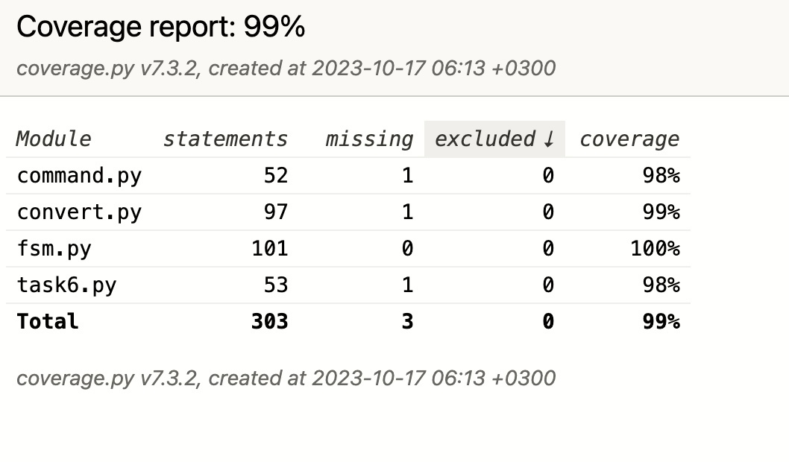

# Regular expression to finite state machine
### regex format:
* `a + b` means `a` or `b`
* `a * b` means `ab`
* `a ** n` means `aaaa...aaa` (n times)
* `a ** None` means `eps` or `a` or `aa` or ...
* `0` means nothing (empty set of possible strings)
* `1` means eps
### regex example:
`(a + 1) * (b + 1)` means `eps` or `a` or `b` or `ab`
### FSM format:
[Described here](https://github.com/dmitrygulevich2000/formal-docs/blob/main/format/dimple.md). Hit ctrl+D (EOF) when done.
## Usage:
`python command.py <input format> <output format> [<labels>]`    
where:    
`<input format>` and `<output format>` should be one of these:
* reg
* eps-non-det-fsm
* non-det-fsm
* det-fsm
* full-det-fsm
* min-full-det-fsm
* invert-full-det-fsm

`<labels>`  - All labels to be used (alphabet). It is mandatory only for making `full-det-fsm`

##### note: if you want just to invert full-det-fsm which is not minimal, you can input it as "min-full-det-fsm" even if it is not minimal. If you input it as full-det-fsm, it would be minimized and then inverted.

### supports conversions only in up-to-down order.
# Tests and coverage:
## Preparation:
```
python3 -m pip install pytest coverage
```
## Tests:
```
pytest ./test_all.py
```
## Coverage:
```
coverage run --include=./fsm.py,./convert.py,./command.py,./task6.py -m pytest ./test_all.py
coverage html
```
## Screenshot:

